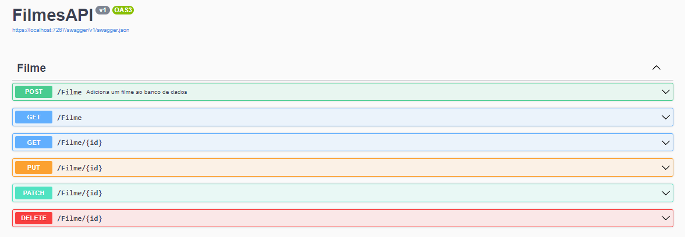

# FilmesAPI

</a>

Repositório criado para fins educacionais e para expôr o projeto feito durante o curso **.NET 6: criando uma web API** da [Alura](https://www.alura.com.br).

## Objetivo
Aprender a utilizar o framework.NET e boas práticas para criar uma API.

## Tecnologias e Ferramentas

