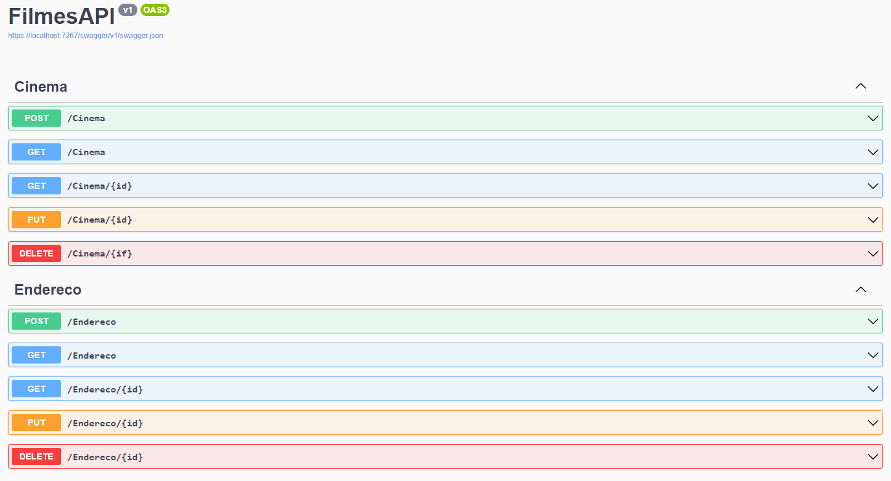
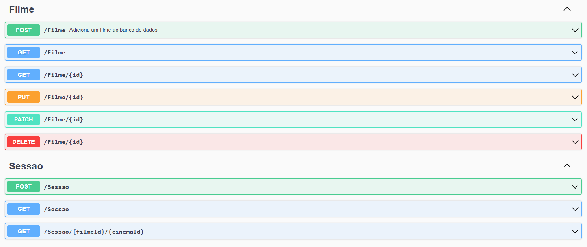

# FilmesAPI

</a>
</a>

Repositório criado para fins educacionais e para expôr o projeto feito durante os cursos **.NET 6: criando uma web API** e **.NET 6: relacionando entidades** da [Alura](https://www.alura.com.br).

## Objetivo
Aprender a utilizar o framework.NET com boas práticas para criar uma API, integrar com um banco de dados e relacionar os modelos entre si.

## Tecnologias e Ferramentas

